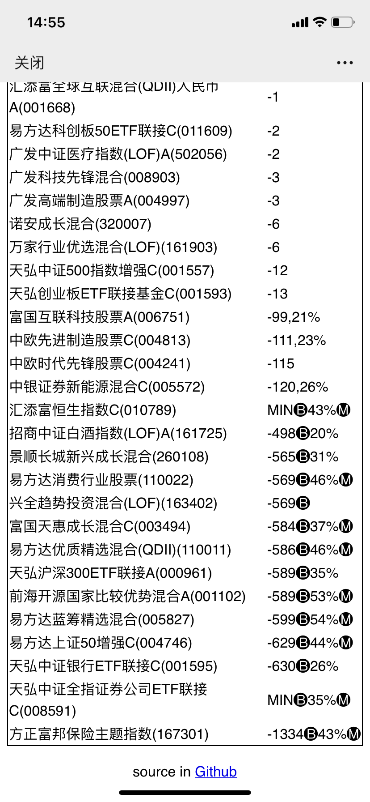
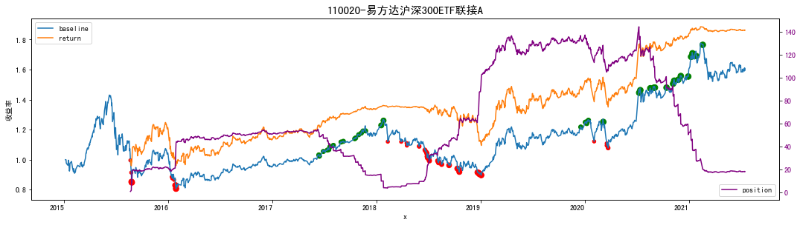

# 基金小作手

## 引言
炒股有两个重要的难题，一个是选股，一个是择时。
买基金（特指投资股票的基金）也一样，好在有很多优秀的主动型基金已经帮我们做好了选股的事情，选择这些业绩好的基金总是没错的，但我们还需要自己来择时。
所谓择时，就是在什么时候买入，什么时候卖出。
买入点至关重要，它在很大程度上决定了最终的收益率，也就是赚10%跟50%的差距。
本项目关注的核心问题就是**基金择时**，抽象成最优化问题就是：给定一只基金的历史数据，判断当前是否为一个好的买入或卖出点，目标是使得收益最大化。
使用这个模型你需要设计一个解决上述问题的策略。

## 功能介绍
本项目包含以下两个功能：

1. **[monitor_funds.py](monitor_funds.py)**: 它可以监控你指定的一揽子的基金，根据你自己设计的策略计算买入卖出的数量或某种自定义的信号，每天发送通知。目前我的关注列表涵盖了大部分热门板块的行业基金、少数长牛基金以及一些关键的指数基金，每天14:45通过email推送，联系我免费订阅。
<p align="center">

</p>

2. **[playground.ipynb](playground.ipynb)**: 通过回测检验自己的策略是否有效，并可视化买入卖出点



关于monitor输出的说明

| 符号 |    说明     |
|-----|-------------|
| MAX | 历史最高点    |
| MIN | 历史最低点    |
| 🅢  | sell 卖出指令 |
| 🅑  | buy 买入指令  |
| 🅜  | 历史最大回撤  |
| M%  | 回撤M%      |


## 我的策略【干货】
关键词：逆市而为 左侧交易 越跌越买

我用的抄底策略大致思路是在某支基金处于低位时发出买入信号，越跌越买，当涨到极大值时分批清仓。
越跌越买是反人性的，在实际操作时很难，借助计算机进行量化投资的好处之一就是能帮助我们克服人性，战胜市场。
该策略无论是在回测中可以秒杀无脑定投 轻松跑赢大盘。

具体算法如下：

1. 每个交易日的**下午2:45**执行以下操作
2. 对每一支感兴趣的基金：
3. 从天天基金网抓取历史累计净值和当前的估值
4. 计算当前的估值**比过去连续N天**的净值高（或者当N为负数时表示低）
5. 何时卖？N为正数并且越大，说明当前的估值越高，适当减仓
6. 何时买？N为负数并且越小，说明当前的估值越低，适当加仓，越跌越买

第5、6步在具体操作的时候可以根据经验自己把握，也可以采取某种定量的策略，例如一种简单的策略如下：

```python
def buy_or_sell(N):
    window = 30
    for k in range(5, 0, -1):
        if N <= -k * window:
            return k
    for k in range(5, 0, -1):
        if N >= k * window:
            return -k
    return 0
```

高抛低吸，越跌越买。
返回值1代表买入单位1，-1代表卖出单位1，我在操作的时候1单位是100RMB。
```
>>> buy_or_sell(10)
0
>>> buy_or_sell(30)
-1
>>> buy_or_sell(60)
-2
>>> buy_or_sell(200)
-5
>>> buy_or_sell(-1)
0
>>> buy_or_sell(-30)
1
>>> buy_or_sell(-90)
3
>>> buy_or_sell(-200)
5
```

### benchmark

以沪深300指数基金为例，随机选择2年的时间进行回测，重复100次。其中某一次回测的结果显示跟市场相比的胜率为0.67，跟定投相比的胜率：0.87。

平均收益率如下：

|  模型   | 平均收益率(600天)|
|--------|----------------|
| 市场    |       12.5%    |
| 定投    |        6.4%    |
| model1 |       16.4%    |

重跑的结果也都差不多。
有两点发现：

1. 测试的时间段足够长的话可以大概率跑赢市场
2. 定投A股指数的收益率很低很低


### shortcoming
这个策略并不是对所有基金都有效，比如纳斯达克100那种长期以来整体上涨的基金最优的方法就是buy and hold。
本策略偏爱一些波动大的基金，比如诺安成长混合。


## 一些个人的思考

### 关于选股和择时
一方面，你希望买到一只潜力股，过上几年翻好几倍，买入的时机不重要，即使买在了高位也不用太担心。为了找到这样的潜力股，你需要对这家公司做一些基本面分析，专业要求比较高，这个就叫做价值投资，代表性的人物是巴菲特，基金经理一般也采用这种方式。
另一方面，你希望抄底买在最低点，涨到严重高估时再脱手，买入的股票是不是长期优质股就不重要了，尤其是在大牛市初期，不管你买什么都能赚钱，这种叫做趋势投资，从大盘的起落中赚钱，伟大的操盘手利弗莫尔就是一位趋势投资者；当利用个股的波动赚钱时，一般称为做波段。

我个人在投资个股或基金时偏向于做波段。
首先，我不愿花很多时间去预测一家公司数年后的股价，散户在这方面肯定是干不过专业的投资者，而且，根本没有人可以预测未来；第二，手里的股票涨了很多之后还能继续拿着其实是很困难的，这就导致会错过很多涨10+倍的机会。
还有一类散户会跟着热点或新闻追涨杀跌，放短线，赚快钱。不能说这种方式不好，凡是能赚到钱那就好的投资策略，但会很累，而且钱来得快，去得也快。


### 我的基金投资纪律

关于选择基金：

* 不要追涨大举买入热点板块的基金
* 不要买一些冷门的行业主题基金，即使估值已经很低了。因为这种基金上涨的潜力小，而且周期长
* 不要梭哈买上一年的冠军基金

关于买：

* 不要盲目定投，拉长时间来看大部分基金定投的年化收益率其实都低的可怜
* 选择多支**长期看涨的优秀基金**，在一个低估值的点开始建仓，越跌越要大胆买
* 单只基金当日投资不要超过1000元
    * 如果该基金正在下跌，这么做的主要目的是防止抄底抄在半山腰被套，后面很有可能还会继续下跌，留着弹药
    * 遇到大盘砸下来，可以多买几只基金
* 对于纳斯达克100这种一直震旦上涨并且延迟比较大的QDII基金，没法根据市场涨跌情况及时作出买入操作，只能长期定投，遇到回调就多买点
* 任何基金，最佳建仓时机是大盘指数低谷的时候
* 在时机来临之前，宁可让钱躺银行也不随便买

关于卖：

* 设置止盈线12%，15%，20%，每次达到目标后果断卖出1/2，见好就收，落袋为安
* 对于纳斯达克100这种长牛基金，不要轻易卖出，一直拿着是最好的，就当是存钱
